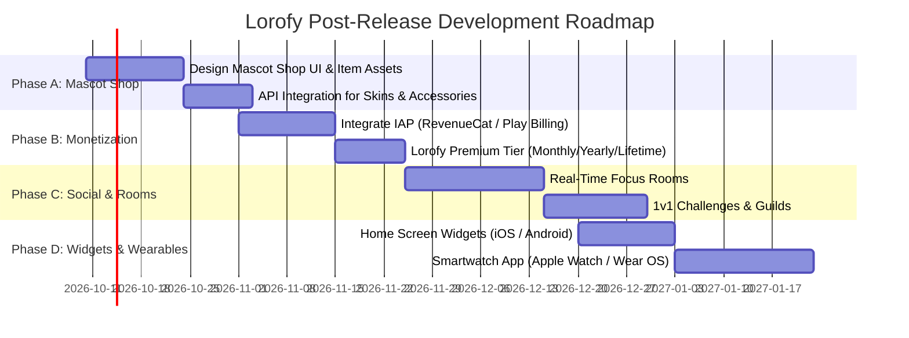

# 🦉 Lorofy - Development Plan & Project Roadmap

> **Project Status:**  
> ✅ **Core Features & Closed Testing Completed**  
> 🚀 **OFFICIALLY RELEASED ON GOOGLE PLAY STORE!**  
> 🔗 **Store Link:** [https://play.google.com/store/apps/details?id=com.lorofy.app](https://play.google.com/store/apps/details?id=com.lorofy.app)  
> 📈 **Current Phase: Post-Release Marketing Execution & Feature Expansion (v1.1+)**

---

## 🟢 PART 1: COMPLETED & RELEASED FEATURES (v1.0.3+7)

The following core modules have been fully implemented, published, and verified live on Google Play:

### 1. Core Focus Engine (Pomodoro)
- [x] Custom Pomodoro timer parameters (Focus Time, Short Break, Long Break, Rounds).
- [x] Strict / Deep Focus Mode with warning dialogs and points penalty on premature give-up.
- [x] Session category management (Studying, Work, Reading, Creativity, etc.).
- [x] Background timer service and real-time status notifications.

### 2. App Whitelist & App Blocker System
- [x] Automated scanner for installed applications on Android & iOS.
- [x] Custom Whitelist selection allowing productivity apps (Dictionaries, Calculators, Notion) during sessions.
- [x] Smooth onboarding and permission dialog flow for `UsageStatsManager` / system access.

### 3. Interactive Mascot System
- [x] Real-time dynamic animations (Rive & Lottie) displaying mascot emotions (Focusing, Break time, Victory celebration, Disappointment on give-up).
- [x] Initial mascot companion selection.

### 4. Ambient Soundscape Player
- [x] High-quality ambient audio player (Rain, Ocean Waves, Coffee Shop, Forest Sounds) for brainwave optimization.
- [x] Independent sound controls and playlist navigation in the Explore module.

### 5. Gamification, Streak & Leaderboard
- [x] Consecutive focus day tracking (Streak) with celebration screens.
- [x] Rank reward points (Lorofy Points) granted upon successful session completion.
- [x] Global Leaderboard tracking total focus minutes and rankings on Daily/Weekly scales.

### 6. Authentication, Profile & Analytics
- [x] Email OTP authentication, Google Sign-In, and secure JWT token lifecycle management.
- [x] Interactive onboarding guiding new users through goal selection.
- [x] Productivity charts (`fl_chart`) & personal activity logs (`My Activities`).

---

## 🟡 PART 2: NEXT DEVELOPMENT PHASES (POST-RELEASE ROADMAP)

With the app live on Google Play, subsequent engineering releases (v1.1+) will focus on **User Retention**, **Monetization**, and **Social Collaboration**.

### 🎨 Phase A: Mascot Shop & Customization
- [ ] **Mascot Shop UI:** Build a dedicated shop interface for Mascot costumes and room decorations.
- [ ] **Item System:** 
  - Redeem new Mascot Skins using **Lorofy Points** earned from focus sessions.
  - Unique accessories (Sunglasses, Graduation Caps, Backpacks, Instruments).
  - Customizable study room backgrounds.
- [ ] **Gacha / Mystery Boxes:** Lucky reward boxes unlocked by achieving streak milestones.

### 💎 Phase B: Subscription & Monetization (Lorofy Premium)
- [ ] **In-App Purchase (IAP) Integration:** Utilize RevenueCat or `in_app_purchase` for seamless cross-platform subscriptions.
- [ ] **Subscription Plans:** 
  - **Lorofy Premium Monthly** (Recurring monthly subscription).
  - **Lorofy Premium Yearly** (Discounted annual pass).
  - **Lifetime Pass** (One-time payment for early supporters).
- [ ] **Premium Benefits:**
  - Unlock complete catalog of Exclusive Ambient Soundscapes.
  - Unlimited apps in custom Whitelist.
  - Advanced 365-day Analytics & PDF Report Exports.
  - Exclusive VIP Mascot Skins and Profile Badges.

### 👥 Phase C: Social Focus Rooms & Team Challenges
- [ ] **Focus Rooms:** Real-time virtual study rooms for groups and friends.
- [ ] **1v1 & Team Challenges:** Compete with friends on consecutive focus streaks.
- [ ] **Study Guilds:** Join study clubs and automatically share group rankings.

### ⌚ Phase D: Home Screen Widgets & Smartwatch Companion
- [ ] **Home Screen Widgets (iOS WidgetKit / Android):** 
  - Display Mascot status, current Streak, and 1-tap Quick Start button on home screens.
- [ ] **Smartwatch Companion (Apple Watch / Wear OS):** 
  - Track remaining session time and receive haptic feedback directly on wrist devices.

---

## 🚀 PART 3: MARKETING & GO-TO-MARKET STRATEGY

Now that Lorofy is officially live at `https://play.google.com/store/apps/details?id=com.lorofy.app`, the marketing rollout is active:

---

### 📌 Phase 1: App Store Optimization (ASO Maintenance)
- **Active Store Link:** [Lorofy on Google Play](https://play.google.com/store/apps/details?id=com.lorofy.app)
- **Visual Presentation:** 5-8 benefit-driven screenshot captions.
- **Store Review Campaign:** Prompt satisfied users to leave 5-star ratings on Google Play after completing 3 focus sessions.

---

### 📌 Phase 2: Launch Week & Community Seeding (Active Now)
*Goal: Acquire 1,000 - 5,000 initial users & drive organic word-of-mouth*

1. **Short-Form Content Strategy (TikTok, Instagram Reels, YouTube Shorts):**
   - Include direct link in bio pointing to `https://play.google.com/store/apps/details?id=com.lorofy.app`.
   - High-converting hooks:
     - *"The study app that saved my GPA without deleting TikTok"*
     - *"Testing the cutest gamified Pomodoro app for study marathons"*
     - *"POV: Giving up on a focus timer and disappointing your Mascot"*
2. **Community Seeding (Reddit, Facebook Groups, Threads):**
   - Share authentic creator stories on `r/getdisciplined`, `r/StudyTips`, Studygram communities, and student forums with direct Play Store links.
3. **Launch Day Offer:**
   - Grant **500 Lorofy Points** + an **Early Bird Badge** for all users registering during launch week.

---

### 📌 Phase 3: Viral Campaign & User Acquisition (Weeks 3 - Month 2)
*Goal: Accelerate organic growth & turn daily usage into a sticky habit*

1. **7-Day Focus Challenge (`#7DayFocusWithLorofy`):**
   - Challenge users to share daily Mascot & Streak progress on Instagram/TikTok Stories to earn exclusive Mascot skins.
2. **Referral Program:**
   - *"Invite a study buddy -> Both earn 100 bonus Lorofy Points"*.
3. **Micro-Influencer Partnerships:**
   - Partner with targeted Studygrammers & Study TikTokers (10k - 50k followers) for organic "Study With Me" product integrations.

---

### 📌 Phase 4: Retention Push & Premium Monetization (Month 3 Onward)
*Goal: Maintain high retention (D7 > 35%, D30 > 15%) & convert free users to Premium*

1. **Smart Re-Engagement Notifications:**
   - Personality-driven push notifications from the Mascot.
2. **Free Trial Push for Premium:**
   - Offer a 7-day free trial of Lorofy Premium upon unlocking exclusive soundscapes & Mascot skins.

---

## 📊 KEY PERFORMANCE INDICATORS (KPIs)

| Metric | Month 1 Target | Month 3 Target |
|---|---|---|
| **Total Downloads** | 5,000+ | 30,000+ |
| **Store Rating** | 4.8★+ (100+ reviews) | 4.8★+ (500+ reviews) |
| **Active Users (DAU)** | 1,000+ | 6,000+ |
| **D7 Retention Rate** | > 35% | > 40% |
| **Premium Conversion Rate** | - | 2.5% - 4.0% |
